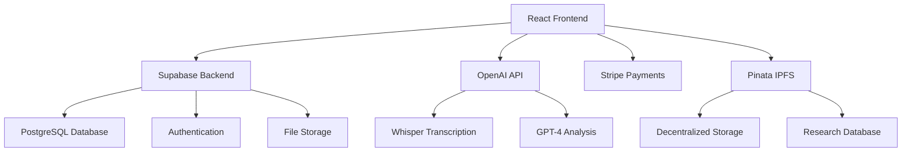

# EchoSense 🎵🦅

> **Understand the wild with the sound of nature**

EchoSense is a cutting-edge web application that captures, identifies, and interprets animal sounds using state-of-the-art AI technology. Transform your wildlife encounters into meaningful insights and contribute to conservation research.


## ✨ Features

### 🎤 **Acoustic Identification**
- Record animal sounds using your device's microphone
- Real-time species identification with confidence scoring
- Advanced call type classification (alarm, mating, territory, contact calls)
- Powered by OpenAI's Whisper and GPT-4 models

### 🧠 **Behavioral Context Insights**
- AI-generated interpretations of animal vocalizations
- Detailed behavioral explanations and context
- Alternative species suggestions for uncertain identifications
- Acoustic feature analysis for premium users

### 📚 **Personalized Sound Library**
- Save and organize all your wildlife recordings
- Location and timestamp tracking
- Advanced search and filtering capabilities
- Personal statistics and achievements

### 🔬 **Research Contributions**
- Contribute recordings to scientific research databases
- Decentralized storage via IPFS/Pinata
- Anonymous data sharing for conservation efforts
- Research impact tracking

### 📊 **Premium Features**
- Unlimited daily recordings
- Advanced spectrogram visualization
- Detailed acoustic analysis
- Offline mode support
- Priority AI processing

## 🚀 Live Demo

**[Try EchoSense Now →](https://echosense.app)**

*Note: Demo requires microphone access and works best in quiet environments*

## 🛠 Tech Stack

| Category | Technology |
|----------|------------|
| **Frontend** | React 18, Vite, TailwindCSS |
| **Backend** | Supabase (PostgreSQL, Auth, Storage) |
| **AI/ML** | OpenAI API (Whisper, GPT-4) |
| **Payments** | Stripe |
| **Storage** | IPFS via Pinata |
| **Deployment** | Vercel, Netlify |
| **Audio Processing** | Web Audio API, Canvas API |

## 📋 Prerequisites

- Node.js 18+ 
- npm or yarn
- Modern web browser with microphone access
- OpenAI API key
- Supabase account

## 🏃‍♂️ Quick Start

1. **Clone the repository**
   ```bash
   git clone https://github.com/vistara-apps/echosense.git
   cd echosense
   ```

2. **Install dependencies**
   ```bash
   npm install
   ```

3. **Set up environment variables**
   ```bash
   cp .env.example .env
   # Edit .env with your API keys
   ```

4. **Start development server**
   ```bash
   npm run dev
   ```

5. **Open your browser**
   Navigate to `http://localhost:5173`

## ⚙️ Environment Configuration

Create a `.env` file in the project root:

```bash
# Required - OpenAI API for AI analysis
VITE_OPENAI_API_KEY=sk-proj-your-openai-api-key

# Required - Supabase for backend services
VITE_SUPABASE_URL=https://your-project.supabase.co
VITE_SUPABASE_ANON_KEY=your-supabase-anon-key

# Optional - Stripe for premium subscriptions
VITE_STRIPE_PUBLISHABLE_KEY=pk_test_your-stripe-key

# Optional - Pinata for IPFS storage
VITE_PINATA_API_KEY=your-pinata-api-key
VITE_PINATA_SECRET_KEY=your-pinata-secret-key
```

## 📖 Documentation

- **[API Documentation](docs/API_DOCUMENTATION.md)** - Complete API specifications
- **[Deployment Guide](docs/DEPLOYMENT_GUIDE.md)** - Production deployment instructions
- **[User Guide](docs/USER_GUIDE.md)** - How to use EchoSense effectively
- **[Contributing](CONTRIBUTING.md)** - Development and contribution guidelines

## 🏗 Architecture



## 🎯 User Flows

### Recording & Analysis Flow
1. **Record** → User captures animal sound
2. **Process** → Audio sent to OpenAI Whisper for transcription
3. **Analyze** → GPT-4 identifies species and provides insights
4. **Display** → Results shown with confidence scores
5. **Save** → Recording stored in personal library

### Premium Upgrade Flow
1. **Discover** → User hits free tier limits
2. **Upgrade** → Stripe checkout for premium subscription
3. **Unlock** → Access to advanced features
4. **Enjoy** → Unlimited recordings and premium tools

## 🔒 Security & Privacy

- **Data Encryption**: All data encrypted in transit and at rest
- **Privacy First**: Location data is optional and anonymized
- **Secure Authentication**: JWT tokens with Row Level Security
- **API Key Protection**: Server-side API key management
- **GDPR Compliant**: Full data privacy compliance

## 🌍 Contributing to Conservation

EchoSense enables users to contribute to real conservation efforts:

- **Research Database**: Anonymous contributions to scientific research
- **Species Monitoring**: Track biodiversity in local areas
- **Citizen Science**: Democratize wildlife research participation
- **Open Data**: CC-BY-4.0 licensed research contributions

## 📊 Pricing

| Feature | Free | Premium ($5/month) |
|---------|------|-------------------|
| Daily Recordings | 5 | Unlimited |
| Species ID | ✅ | ✅ |
| Basic Insights | ✅ | ✅ |
| Advanced Analysis | ❌ | ✅ |
| Spectrogram View | ❌ | ✅ |
| Offline Mode | ❌ | ✅ |
| Research Tools | ❌ | ✅ |

## 🤝 Contributing

We welcome contributions! Please see our [Contributing Guide](CONTRIBUTING.md) for details.

1. Fork the repository
2. Create a feature branch
3. Make your changes
4. Add tests if applicable
5. Submit a pull request

## 📝 License

This project is licensed under the MIT License - see the [LICENSE](LICENSE) file for details.

## 🙏 Acknowledgments

- **OpenAI** for providing advanced AI models
- **Supabase** for backend infrastructure
- **Conservation Organizations** for research partnerships
- **Open Source Community** for tools and libraries
- **Wildlife Researchers** for domain expertise

## 📞 Support

- **Documentation**: [docs/](docs/)
- **Issues**: [GitHub Issues](https://github.com/vistara-apps/echosense/issues)
- **Discussions**: [GitHub Discussions](https://github.com/vistara-apps/echosense/discussions)
- **Email**: support@echosense.app

## 🗺 Roadmap

- [ ] **Mobile App** - Native iOS and Android applications
- [ ] **Offline AI** - Local species identification models
- [ ] **Social Features** - Community sharing and collaboration
- [ ] **Advanced Analytics** - Detailed biodiversity insights
- [ ] **API Access** - Public API for researchers and developers
- [ ] **Multi-language** - Support for multiple languages

---

**Made with ❤️ for wildlife conservation and citizen science**

*EchoSense - Understand the wild with the sound of nature* 🌿🎵
